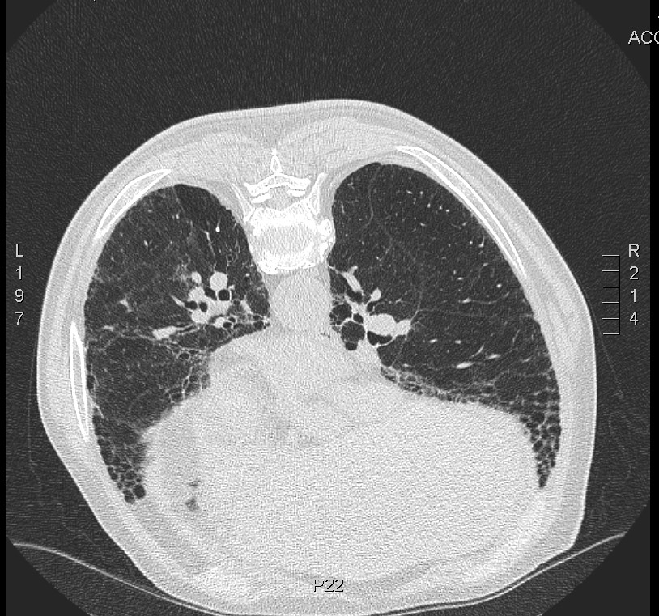
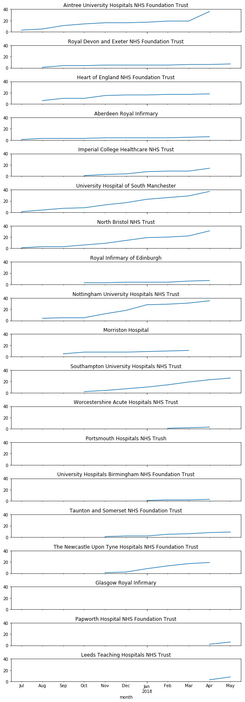

% Late stage review presentation 

# Hello I'm Carl, welcome to my four part LATE STAGE REVIEW

##

1. Explaining the question 
2. Looking at how much IPF is attributable to occupational exposures 
3. Thinking about historic asbestos exposure assessment  
4. Reviewing the progress of my case-control study

# 1. Explaining the question

## Is occupational asbestos exposure an under-recognised cause of IPF?

##

the question is not new; it arises because it is clinically plausible, epidemiologically plausible, and consistent with
fibre studies and case-control data

## 

- clinical presentation can be similar
- radiologically and histopathologically both give rise to UIP - no differentiating biomarkers
- doctors may not elicit previous asbestos exposure and patients may not recall it
- unclear what dose is needed

## 

- IPF more common in men, manual workers, those living in industrial regions
- correlation with asbestos imports (Barber et al. 2015)
- correlation with asbestos related disease, cohort effect

## Seen in the clinic

##

CT request: 80 year old man, soboe, fine creps, asbestos exposure. 

## 

{ width=65%  }

##

"There is extensive coarse reticular shadowing most marked in the lower lobes but extending also into the upper lobes. There are calcified pleural plaques over the left hemidiaphragm. No other abnormality noted.

The parenchymal changes are more **suggestive of IPF rather than asbestos-related interstitial lung disease** although I cannot exclude this."

##

He worked as industrial lagger in power stations and railways for 40 years. Wife has pleural plaques. 

## What I'm doing

## 

To address the question of asbestos exposure in IPF in this thesis I am carrying out a literature review and meta-analysis of occupational exposures in IPF, a literature review of historic asbestos exposure assessment, and a hospital based case-control study: the idiopathic pulmonary fibrosis job exposures study (IPFJES).

# 2. Looking at how much IPF is attributable to occupational exposures

##

Literature review and meta-analysis

## 

I searched pubmed, embase, and google scholar for combinations of the terms 'idiopathic pulmonary fibrosis', 'occupation', 'case-control study' and synonyms. When a relevant paper was identified, papers referenced, and papers citing, the paper were reviewed. Medline ranker and bespoke pubmed 'mining' techniques that I developed as part of this thesis were also used. 

##

- 15 case-control studies
- most use community controls (with poor response rates)
- most use self-reported exposure measures; none quantify asbestos exposure
- occupational overlap with mesothelioma case-control studies e.g metal-plate workers
- associations with common asbestos co-exposures e.g metal and wood dust 

##

I carried out a meta-analysis of 12 of the 15 case-control studies; pooled PAF estimates by exposure category (metal, wood, agricultural dust, stone, VGDF) ranged from 3\%(silica) to 23\%(VGDF).  

##

- PAF = pc(OR - 1) / OR, where pc is the proportion of cases exposed and OR is the odds ratio
- Stata metan and metaprop used to calculate pooled OR and PAF respectively
- The 95\% confidence interval for the OR and PAF from each study included was computed using exact method
- Fixed effect model where heterogeneity low, random effects model where heterogeneity high

##

| Exposure           | Risk estimates (n) | Pooled OR (95% CI) | Pooled PAF \% (95% CI) |
|--------------------|--------------------|--------------------|------------------------|
| VGDF               | 7                  | 1.7 (1.2-2.5)      | 23 (11-35)             |
| Metal dusts        | 9                  | 2 (1.3-3)          | 8 (4-13)               |
| Wood dusts         | 11                 | 1.7 (1.3-2.2)      | 4 (2-6)                |
| Agricultural dusts | 5                  | 1.6 (0.8-3.0)      | 4 (0-12)               |
| Silica             | 8                  | 1.7 (1.2-2.4)      | 3 (2-5)                |

# 3. Thinking about historic asbestos exposure assessment  

##

I searched pubmed, embase, and google scholar for combinations and synonyms of "asbestos", "exposure assessment", together with terms for modes of assessment including "lung biopsy", "bronchoalveolar lavage", "exposure reconstruction", and "job-exposure matrix". When a relevant paper was identified, papers referenced, and papers citing, the paper were reviewed.

##

- demonstration of asbestos fibres on lung biopsy in the context of pulmonary fibrosis is clearly supportive of the diagnosis of asbestosis  
- failure to demonstrate fibres can not be used to rule out asbestos exposure because fibres, particularly chrysotile fibres, may be cleared 
- significant false-negative rate

##

- historic workplace measurements can a source of evidence for attributing exposure
- occupational hygienists have recorded a large numbers of workplace measurements of asbestos in different settings, at different times, using a variety of different means
- issues with accuracy and comparability of methods
- issues with representativeness 

##

- no universally agreed 'gold standard'
- agreement between exposure assessment using job title and PMR and fibre-counts in mesothelioma case-control studies
- some asbestos exposure modelling systems show good correlation with measurement data
- quantitative estimates of exposure have high uncertainty but relative difference in exposure among epidemiological groups can be quite certain

# 4. Reviewing the progress of my case-control study 

## Idiopathic pulmonary fibrosis job exposure study (IPFJES)

##

- (another) hospital-based case-control study
- lifetime occupational histories combined with occupational proportionate mortality ratios for mesothelioma and a job-process based asbestos exposure assessment
- blood test for susceptibility genetics to investigate gene-exposure interactions
- basically a telephone-interview + blood test for 920 patients at 19 centres
  
##

- core team of Rupa Sisodia and me (not possible without Rupa)
- funded by Wellcome Trust and in the NIHR portfolio; all regulatory approvals in place
- registered [clinicaltrials.gov NCT03211507](https://clinicaltrials.gov/ct2/show/NCT03211507)
- full study documentation online at [www.ipfjes.org](http://ipfjes.org/)

## What progress made?

## 

since starting in October 2016 I have obtained REC, HRA, and local R&D approvals, finalised study documentation, developed computer assisted interview software, built a study website, appointed a research assistant and a lab assistant, carried out training in asbestos exposure assessment, site initiation visits, recruited and interviewed participants, analyzed interview data, begun dna extraction and genotyping, and complied with new legislation (GDPR)

## Recruitment

##

- All [19 organisations](https://batchgeo.com/map/3fe51a6c9576af5379b7cb7604ce9b82) are recruiting
- 281 cases and 101 controls recruited as of June 1st
- Big range in [recruitment](http://ipfjes.org/) between centres from Liverpool (61) to Glasgow (2).

##

{ width=80% }

##

{ width=23% }

## Lab work

##

- DNA extracted for 39 participants to date, reasonable DNA yield   
- No participants genotyped yet

## Interim analysis

## Number of cases and controls

281 cases, 101 controls

## Age breakdown

    	    count       mean       std   min   25%   50%   75%   max
    pt                                                               
    case     281.0      74.8       7.8   52.0  70.0  75.0  80.0  92.0
    control  101.0      70.7       8.2   40.0  66.0  70.0  76.0  93.0

## Ethnicity

272 cases white, 1 black british, 1 mixed. 99 controls white, 1 asian british, 1 other.

## Ever smoked

210 cases (75%) and 71 (70%) of controls were current or previous smokers.

## Current smoker

6 cases (2%) and 8 controls (8%) were current smokers.

## Social class (based on all jobs)

    	     count  mean       std       min  25%  50%  75%  max
    pt                                                          
    case     1268.0  4.6       2.0       1.1  3.0  5.0  6.0  7.0
    control   419.0  4.5       2.1       1.1  3.0  5.0  7.0  7.0

## Social class (based on lowest social class code job)

   	     count      mean      std       min  25%  50%  75%  max
    pt                                                         
    case     281.0  3.2       1.8       1.1  2.0  3.0  5.0  7.0
    control  101.0  3.0       1.7       1.1  1.2  2.0  4.0  7.0

## Asbestos exposed job(%) of all jobs(according to Peto)

    pt
    case       10.5
    control     8.7

## Patients with at least 1 asbestos exposed job(%) (according to Peto)

    pt
    case       25.3
    control    24.8
    Name: patient_id, dtype: float64

## Average cumulative risk

    pt
    case       9.1
    control    8.7
    dtype: float64

## Distance from centre (study av) in km

    pt
    case       26.7
    control    14.6
    Name: distfromcentre, dtype: float64

## Geographic confounding?

Limiting the analysis to participants living within 10km of the recruiting hospital (74 cases, 47 controls) resulted in a increase in the percentage of exposed jobs for cases (25%) but not controls (19%). By direct simulation this was not a statistically significant difference.

# Future work

##

- add centres, complete recruitment and interviews 
- complete DNA extraction and genotyping
- finalize analysis plans and carry out analysis
- write papers

# Any questions?

##

- <carl.reynolds@imperial.ac.uk> 
- [drcjar](https://twitter.com/drcjar) | [ipfjes](https://twitter.com/ipfjes)
- [www.carlreynolds.net](http://carlreynolds.net/) | [www.ipfjes.org](http://ipfjes.org/)

