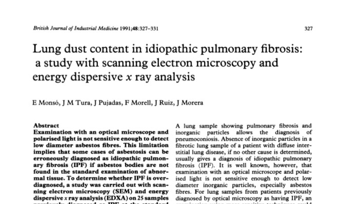
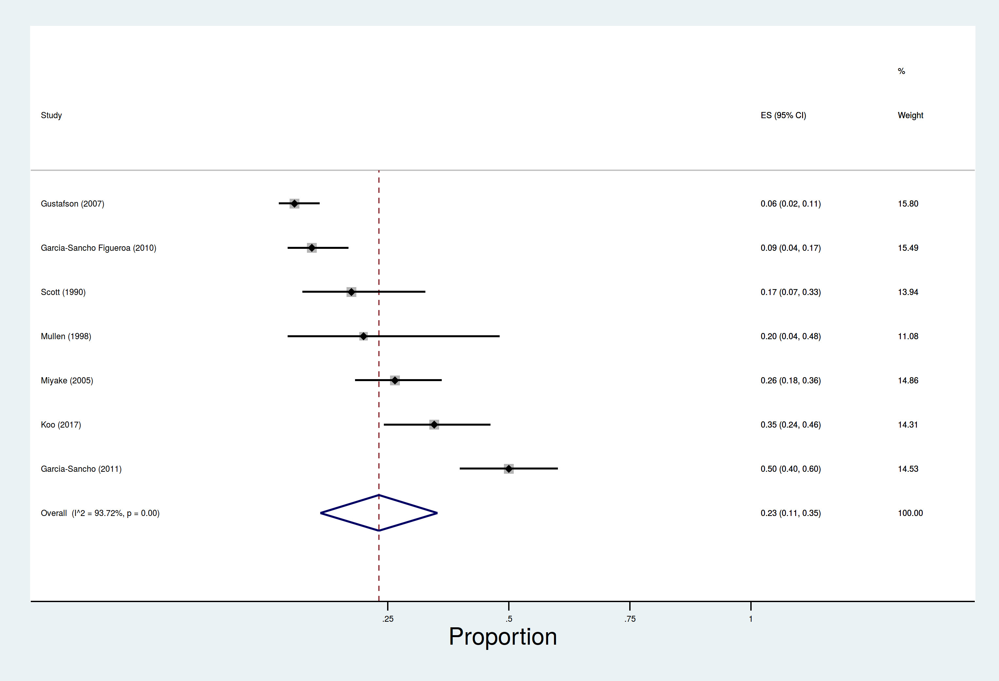

% LSR Presentation
% Dr Carl Reynolds 

# Is occupational asbestos exposure an under-recognised cause of IPF?

##

the question is not new; it arises because it is clinically plausible, epidemiologically plausible, and consistent with
fibre studies and case-control data

## 

- clinical presentation can be similar
- radiologically and histopathologically both give rise to UIP - no differentiating biomarkers
- doctors may not elicit previous asbestos exposure and patients may not recall it
- unclear what dose is needed

## 

- IPF more common in men, manual workers, those living in industrial regions
- correlation with asbestos imports (Barber et al. 2015)
- correlation with asbestos related disease, cohort effect

##

{ width=65% }

##

{ width=65% }

## Seen in the clinic

##

CT request: 80 year old man, soboe, fine creps, asbestos exposure. 

## 

{ width=65%  }

##

"There is extensive coarse reticular shadowing most marked in the lower lobes but extending also into the upper lobes. There are calcified pleural plaques over the left hemidiaphragm. No other abnormality noted.

The parenchymal changes are more **suggestive of IPF rather than asbestos-related interstitial lung disease** although I cannot exclude this."

##

He worked as industrial lagger in power stations and railways for 40 years. Wife has pleural plaques. 

## Fibre studies and case-control data

## 

##

- 15 case-control studies
- most use community controls (with poor response rates)
- most use self-reported exposure measures; none quantify asbestos exposure
- occupational overlap with mesothelioma case-control studies e.g metal-plate workers
- associations with common asbestos co-exposures e.g metal and wood dust 

##

I carried out a meta-analysis of 12 of the 15 case-control studies; pooled PAF estimates by exposure category (metal, wood, agricultural dust, stone, VGDF) ranged from 3\%(silica) to 23\%(VGDF) 

##

| Exposure           | Risk estimates (n) | Pooled OR (95% CI) | Pooled PAF \% (95% CI) |
|--------------------|--------------------|--------------------|------------------------|
| VGDF               | 7                  | 1.7 (1.2-2.5)      | 23 (11-35)             |
| Metal dusts        | 9                  | 2 (1.3-3)          | 8 (4-13)               |
| Wood dusts         | 11                 | 1.7 (1.3-2.2)      | 4 (2-6)                |
| Agricultural dusts | 5                  | 1.6 (0.8-3.0)      | 4 (0-12)               |
| Silica             | 8                  | 1.7 (1.2-2.4)      | 3 (2-5)                |

##

# Does it matter? 

##

- it's bad to not know the cause of a killer disease that is becoming more common
- there is ongoing asbestos exposure globally 
- there is reason to think some IPF is due to asbestos, if this is the case we can better understand and prevent IPF globally

# What's IPFJES? 

## 

- (another) hospital-based case-control study
- lifetime occupational histories combined with occupational proportionate mortality ratios for mesothelioma and a job-process based asbestos exposure assessment
- blood test for susceptibility genetics to investigate gene-exposure interactions
- basically a telephone-interview + blood test for 920 patients at 16 centres
  
##

- funded by Wellcome Trust and in the NIHR portfolio; all regulatory approvals in place
- registered [clinicaltrials.gov NCT03211507](https://clinicaltrials.gov/ct2/show/NCT03211507)
- full study documentation online at [www.ipfjes.org](http://ipfjes.org/)

# Progress to date

##

since starting in October 2016 I have obtained REC, HRA, and local R&D approvals, finalised study documentation, developed computer assisted interview software, built a study website, appointed a research assistant and a lab assistant, carried out training in asbestos exposure assessment, site initiation visits, recruited and interviewed participants, analyzed interview data, begun dna extraction and genotyping, and complied with new legislation (GDPR)

##

Recruitment

##

- All [19 organisations](https://batchgeo.com/map/3fe51a6c9576af5379b7cb7604ce9b82) are recruiting
- 281 cases and 101 controls recruited as of June 1st
- Big range in [recruitment](http://ipfjes.org/) between centres from Liverpool (61) to Glasgow (2).

##

Lab work

##

- DNA extracted for 39 participants to date, reasonable DNA yield   
- No participants genotyped yet

##

Interim analysis

##

## Number of cases and controls

281 cases, 101 controls

## Age breakdown

    count       mean       std   min   25%   50%   75%   max
    pt                                                               
    case     281.0  74.790036  7.773722  52.0  70.0  75.0  80.0  92.0
    control  101.0  70.722772  8.159802  40.0  66.0  70.0  76.0  93.0

## Ethnicity

272 cases white, 1 black british, 1 mixed. 99 controls white, 1 asian british, 1 other.

## Ever smoked

210 cases (75%) and 71 (70%) of controls were current or previous smokers.

## Current smoker

6 cases (2%) and 8 controls (8%) were current smokers.

## Social class (based on all jobs)

    count      mean       std  min  25%  50%  75%  max
    pt                                                          
    case     1268.0  4.643297  2.027945  1.1  3.0  5.0  6.0  7.0
    control   419.0  4.518616  2.085949  1.1  3.0  5.0  7.0  7.0

## Social class (based on lowest social class code job)

    count      mean       std  min  25%  50%  75%  max
    pt                                                         
    case     281.0  3.157651  1.816124  1.1  2.0  3.0  5.0  7.0
    control  101.0  2.955446  1.684012  1.1  1.2  2.0  4.0  7.0

## Asbestos exposed job(%) of all jobs (according to Coggon)

    pt
    case       20.215219
    control    19.014085
    Name: patient_id, dtype: float64

## Asbestos exposed job(%) of all jobs(according to Peto)

    pt
    case       10.530361
    control     8.685446
    Name: patient_id, dtype: float64

## Patients with at least 1 asbestos exposed job(%) (according to Coggon)

    pt
    case       45.907473
    control    45.544554
    Name: patient_id, dtype: float64

## Patients with at least 1 asbestos exposed job(%) (according to Peto)

    pt
    case       25.266904
    control    24.752475
    Name: patient_id, dtype: float64

## Average cummulative risk

    pt
    case       9.096085
    control    8.742574
    dtype: float64

## OR for IPF if at least 1 asbestos exposed job (according to Coggon)

    OddsR:  1.0147311212814645 p-Value: 1.0

## Distance from centre (study av) in km

    pt
    case       26.740122
    control    14.631911
    Name: distfromcentre, dtype: float64

## Sensitivity analysis

Limiting the analysis to participants living within 10km of the recruiting hospital (74 cases, 47 controls) resulted in a increase in the percentage of exposed jobs for cases (25%) but not controls (19%). By direct simulation this was not a statistically significant difference.

# Future work

##

- complete recruitment and interviews
- complete DNA extraction and genotyping
- finalize analysis plans and carry out analysis
- write papers

# Any questions?

##

- <carl.reynolds@imperial.ac.uk> 
- [drcjar](https://twitter.com/drcjar) | [ipfjes](https://twitter.com/ipfjes)
- [www.carlreynolds.net](http://carlreynolds.net/) | [www.ipfjes.org](http://ipfjes.org/)

